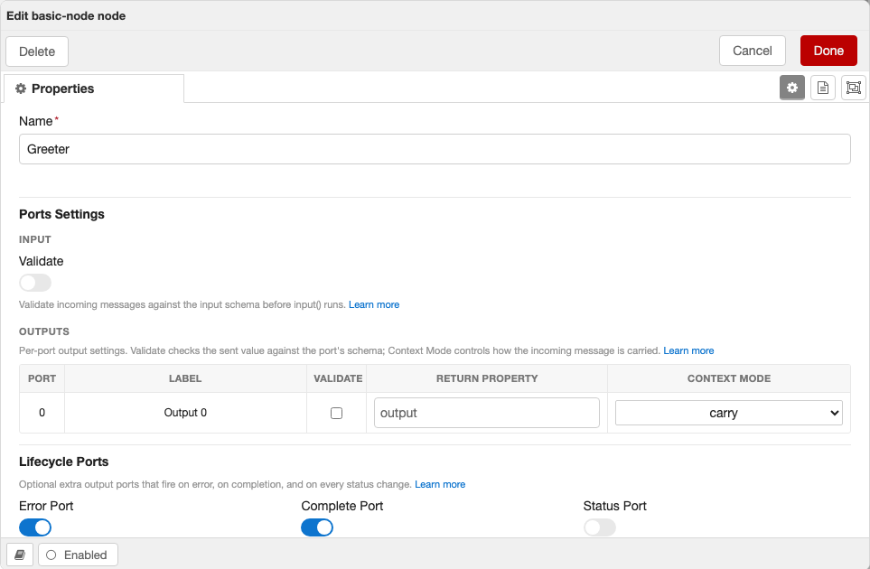

<p align="center">
  
</p>

<p align="center">
  <a href="https://www.npmjs.com/package/@bonsae/nrg"></a>
  <a href="https://github.com/bonsaedev/nrg/actions/workflows/ci.yaml"></a>
  <a href="https://codecov.io/gh/bonsaedev/nrg"></a>
  <a href="https://socket.dev/npm/package/@bonsae/nrg"></a>
</p>

> [!WARNING]
> While **NRG** is at `v0`, breaking changes can land in any release and will **not** bump the major version. Pin an exact version and review the release notes before upgrading.

# NRG

Build Node-RED nodes with Vue 3, TypeScript, JSON Schema validations, Vite and Vitest.

## Quick Start

```bash
pnpm add -D @bonsae/nrg node-red vue vite vitest
```

> All of these are dev dependencies, needed only at build time. `@bonsae/nrg` is the authoring toolkit; a built node depends only on `@bonsae/nrg-runtime` (declared automatically in the generated `dist/package.json`), never the toolkit. Vue is included as a dependency of the runtime and served automatically to the editor.

### Node-RED Resolution

The vite plugin needs a Node-RED instance for the dev server. It resolves it in this order:

1. **`runtime.version`** — if specified in the plugin config, downloads that exact version via `npx` (overrides any locally installed version)
2. **Local `node_modules`** — if `node-red` is installed as a dependency, it is used directly (fastest)
3. **Fallback** — downloads the latest `node-red` via `npx`

Installing `node-red` as a dev dependency is recommended for fast, reliable dev server startup across all platforms (especially Windows). If you need a specific version (e.g., a beta), set `runtime.version` in the plugin config instead.

**vite.config.ts**

```typescript
import { defineConfig } from "vite";
import { nrg } from "@bonsae/nrg/vite";

export default defineConfig({
  plugins: [nrg()],
});
```

**src/server/schemas/my-node.ts**

```typescript
import { defineSchema, SchemaType } from "@bonsae/nrg/server";

export const ConfigsSchema = defineSchema(
  {
    name: SchemaType.String({ default: "" }),
    prefix: SchemaType.String({ default: "hello" }),
  },
  { $id: "my-node:configs" },
);
```

**src/server/nodes/my-node.ts**

NRG supports two ways to define nodes:

<table>
<tr><th>Functional API</th><th>Class API</th></tr>
<tr><td>

```typescript
import { defineIONode, SchemaType } from "@bonsae/nrg/server";
import { ConfigsSchema, InputSchema, OutputSchema } from "../schemas/my-node";

export default defineIONode({
  type: "my-node",
  color: "#ffffff",
  configSchema: ConfigsSchema,
  inputSchema: InputSchema,
  outputsSchema: OutputSchema,

  async input(msg) {
    msg.payload = `${this.config.prefix}: ${msg.payload}`;
    this.send(msg);
  },
});
```

</td><td>

```typescript
import { IONode, type Schema, type Infer } from "@bonsae/nrg/server";
import { ConfigsSchema, InputSchema, OutputSchema } from "../schemas/my-node";

type Config = Infer<typeof ConfigsSchema>;
type Input = Infer<typeof InputSchema>;
type Output = Infer<typeof OutputSchema>;

export default class MyNode extends IONode<Config, never, Input, Output> {
  static readonly type = "my-node";
  static readonly category = "function";
  static readonly color: `#${string}` = "#ffffff";
  static readonly configSchema: Schema = ConfigsSchema;
  static readonly inputSchema: Schema = InputSchema;
  static readonly outputsSchema: Schema = OutputSchema;

  async input(msg: Input) {
    this.send({ payload: `${this.config.prefix}: ${msg.payload}` });
  }
}
```

</td></tr>
<tr>
<td>Automatic type inference, less boilerplate</td>
<td>Custom methods, inheritance, mixins</td>
</tr>
</table>

**src/server/index.ts**

```typescript
import { defineModule } from "@bonsae/nrg/server";
import MyNode from "./nodes/my-node";

export default defineModule({
  nodes: [MyNode],
});
```

See the [consumer template](https://github.com/AllanOricil/node-red-vue-template) for a complete example.

### The generated editor form

NRG builds the node's edit dialog from your schema — no HTML or jQuery. Your config fields render first, then a **Ports Settings** section (input/output validation, return key, and per-port [context modes](https://bonsaedev.github.io/nrg/guide/schemas#context-modes)) and a **Lifecycle Ports** section (error / complete / status):

<p align="center">
  
</p>

## Testing

NRG provides five test libraries and ships most test infrastructure as direct dependencies, so you only need to install `vitest` plus any optional peer dependencies:

```bash
pnpm add -D vitest
```

Optional peer dependencies:

| Package                      | When to install                                              |
| ---------------------------- | ------------------------------------------------------------ |
| `@vitest/browser-playwright` | Component tests (Playwright browser provider for Vitest)     |
| `playwright`                 | Component tests or E2E tests (direct `import` in test files) |
| `vitest-browser-vue`         | Component tests (`render` helper for Vue components)         |
| `@vitest/coverage-v8`        | Coverage with `--coverage` (V8 provider)                     |
| `@vitest/coverage-istanbul`  | Coverage with `--coverage` (Istanbul provider)               |

- `@bonsae/nrg/test/server/unit` — server-side unit tests
- `@bonsae/nrg/test/server/integration` — server-side integration tests (real Node-RED runtime)
- `@bonsae/nrg/test/client/unit` — client-side unit tests (TypeScript logic)
- `@bonsae/nrg/test/client/component` — client component tests (Vue + browser)
- `@bonsae/nrg/test/client/e2e` — browser E2E tests (Playwright)

### Server Unit Tests

Instantiate your node with mocked Node-RED internals and exercise its full lifecycle in-process:

```typescript
// vitest.server.unit.config.ts
import { defineConfig, mergeConfig } from "vitest/config";
import { defaultConfig } from "@bonsae/nrg/test/server/unit/config";

export default mergeConfig(
  defaultConfig,
  defineConfig({
    test: {
      include: ["tests/server/unit/**/*.test.ts"],
    },
  }),
);
```

```typescript
// tests/server/unit/my-node.test.ts
import { describe, it, expect } from "vitest";
import { createNode } from "@bonsae/nrg/test/server/unit";
import MyNode from "../../../src/server/nodes/my-node";

describe("my-node", () => {
  it("should process messages", async () => {
    const { node } = await createNode(MyNode, {
      config: { greeting: "hello" },
    });

    await node.receive({ payload: "world" });

    expect(node.sent(0)).toEqual([{ payload: "hello world" }]);
  });
});
```

### Server Integration Tests

Boot a real, headless Node-RED runtime, deploy your nodes, and drive them with real messages — verifying config-node resolution, credentials, wiring, and context that unit mocks can't. Integration tests live in `tests/server/integration`, separate from `tests/server/unit`. Add `node-red` as a dev dependency, then:

```typescript
// vitest.server.integration.config.ts
import { defineConfig, mergeConfig } from "vitest/config";
import { defaultConfig } from "@bonsae/nrg/test/server/integration/config";

export default mergeConfig(
  defaultConfig,
  defineConfig({
    test: {
      include: ["tests/server/integration/**/*.test.ts"],
    },
  }),
);
```

```typescript
// tests/server/integration/my-node.test.ts
import { describe, it, expect, beforeAll, afterAll } from "vitest";
import {
  startRuntime,
  type Runtime,
} from "@bonsae/nrg/test/server/integration";
import MyNode from "../../../src/server/nodes/my-node";

describe("my-node (integration)", () => {
  let runtime: Runtime;

  beforeAll(async () => {
    runtime = await startRuntime({ nodes: [MyNode] });
  });

  afterAll(async () => {
    await runtime.stop();
  });

  it("processes input in a real runtime", async () => {
    const flow = runtime.flow();
    const node = flow.addNode(MyNode, { greeting: "hello" });
    await flow.deploy();

    await node.receive({ payload: "world" });

    const out = (await node.read()) as { output: { payload: string } };
    expect(out.output.payload).toBe("hello world");
  });
});
```

### Client Unit Tests

Test client-side TypeScript logic (validation, utilities) with mocked `RED` and `$` globals:

```typescript
// vitest.client.unit.config.ts
import { defineConfig, mergeConfig } from "vitest/config";
import { defaultConfig } from "@bonsae/nrg/test/client/unit/config";

export default mergeConfig(
  defaultConfig,
  defineConfig({
    test: {
      include: ["tests/client/unit/**/*.test.ts"],
    },
  }),
);
```

```typescript
// tests/client/unit/my-util.test.ts
import { describe, it, expect } from "vitest";
import { myUtil } from "../src/client/my-util";

describe("myUtil", () => {
  it("works with RED globals", () => {
    expect(myUtil("input")).toBe("expected");
  });
});
```

### Client Component Tests

Test your Vue editor components with mocked Node-RED globals. Components that use `useFormNode()` receive their node data via Vue's `provide`/`inject` — use `createNode().provide` to supply it in tests:

```typescript
// vitest.client.component.config.ts
import { defineConfig, mergeConfig } from "vitest/config";
import { defaultConfig } from "@bonsae/nrg/test/client/component/config";

export default mergeConfig(
  defaultConfig,
  defineConfig({
    test: {
      include: ["tests/client/component/**/*.test.ts"],
    },
  }),
);
```

```typescript
// tests/client/component/my-form.test.ts
import { describe, test, expect, vi } from "vitest";
import { render } from "vitest-browser-vue";
import { createNode } from "@bonsae/nrg/test/client/component";
import MyForm from "../src/client/components/my-form.vue";

describe("MyForm", () => {
  test("renders fields from injected node", async () => {
    const { provide } = createNode({
      name: "test",
      url: "https://example.com",
    });
    const screen = render(MyForm, {
      global: { provide },
    });
    await expect.element(screen.getByDisplayValue("test")).toBeInTheDocument();
  });

  test("accesses node id for API calls", async () => {
    const fetchSpy = vi.fn().mockResolvedValue({ ok: true, json: () => ({}) });
    vi.stubGlobal("fetch", fetchSpy);
    const { node, provide } = createNode({ name: "test" });
    render(MyForm, { global: { provide } });
    await vi.waitFor(() => {
      expect(fetchSpy).toHaveBeenCalledWith(`my-api/${node.id}`);
    });
  });

  test("asserts RED.editor API calls", async () => {
    const { RED, provide } = createNode();
    render(MyForm, { global: { provide } });
    expect(RED.editor.createEditor).toHaveBeenCalled();
  });
});
```

### Client E2E Tests

Drive the real editor in a live Node-RED instance with Playwright — schema-driven forms, validation, TypedInput, config selectors, and i18n. Install `playwright`, then point a global setup at a flow and walk the editor with `NodeRedEditor`:

```typescript
// vitest.client.e2e.config.ts
import { defineConfig } from "vitest/config";
import { defaultConfig } from "@bonsae/nrg/test/client/e2e/config";

export default defineConfig({
  test: {
    ...defaultConfig,
    globalSetup: "tests/client/e2e/global-setup.ts",
    include: ["tests/client/e2e/**/*.test.ts"],
  },
});
```

```typescript
// tests/client/e2e/global-setup.ts
import {
  setup as baseSetup,
  teardown as baseTeardown,
} from "@bonsae/nrg/test/client/e2e";

export async function setup() {
  await baseSetup({
    flow: [
      { id: "tab1", type: "tab", label: "E2E Tests" },
      { id: "n1", type: "my-node", z: "tab1", name: "", wires: [[]] },
    ],
  });
}

export async function teardown() {
  await baseTeardown();
}
```

```typescript
// tests/client/e2e/my-node.test.ts
import { describe, test, expect, beforeAll, afterAll } from "vitest";
import { chromium, type Browser } from "playwright";
import { NodeRedEditor } from "@bonsae/nrg/test/client/e2e";

describe("my-node editor", () => {
  let browser: Browser;
  let editor: NodeRedEditor;

  beforeAll(async () => {
    browser = await chromium.launch();
    const port = Number(process.env.NODE_RED_PORT);
    editor = new NodeRedEditor(await browser.newPage(), port);
    await editor.open();
  });

  afterAll(() => browser.close());

  test("name field round-trips", async () => {
    await editor.editNode("n1");
    const name = editor.field("Name");
    await name.fill("Test Node");
    await editor.clickDone();

    await editor.editNode("n1");
    expect(await name.getValue()).toBe("Test Node");
    await editor.clickCancel();
  });
});
```

See the [testing guide](https://bonsaedev.github.io/nrg/guide/testing) for full API reference.

## Development

```bash
pnpm install
pnpm build                        # build all (server, client, vite plugin, test libs)
pnpm validate                     # type-check + lint + format check
pnpm validate:tsc                 # type-check all tsconfigs
pnpm validate:lint                # eslint
pnpm validate:format              # prettier check
pnpm test                         # run all tests
pnpm test:core:server:unit        # server unit tests
pnpm test:core:server:integration # server integration tests (real Node-RED)
pnpm test:core:client:unit        # client unit tests
pnpm test:core:client:component   # client component tests
pnpm test:core:client:e2e         # client E2E tests
pnpm docs:dev                     # start docs dev server
```

## License

MIT
